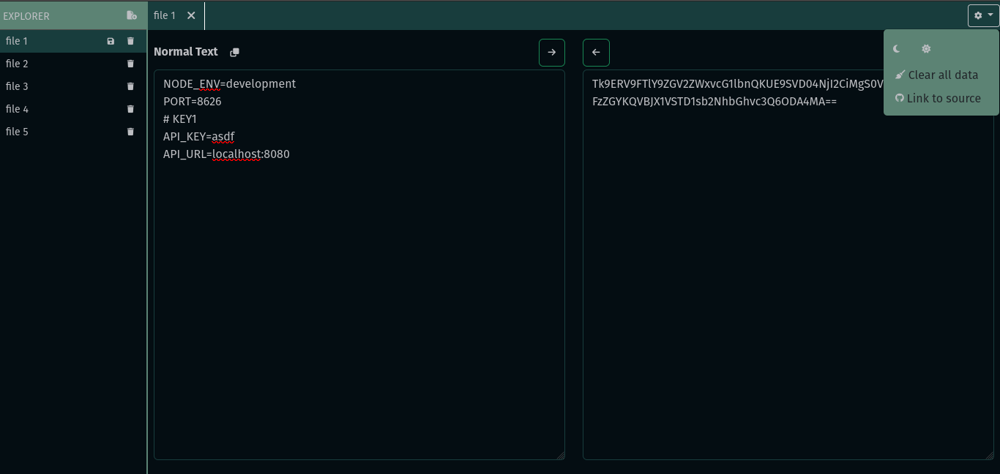
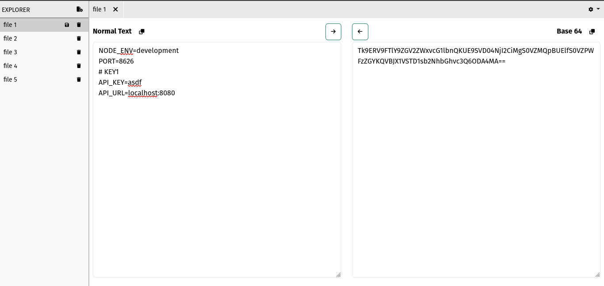
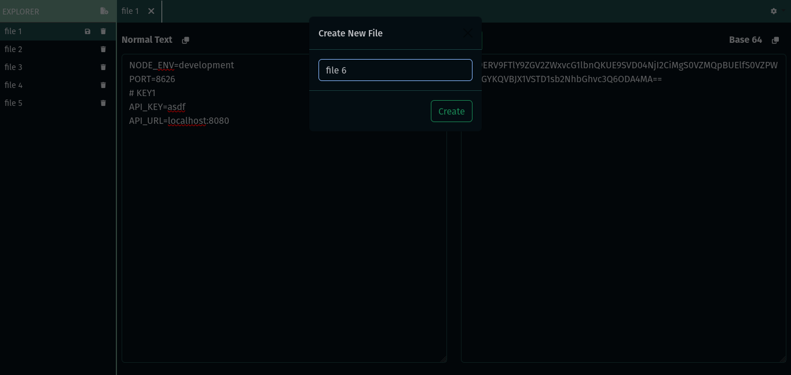
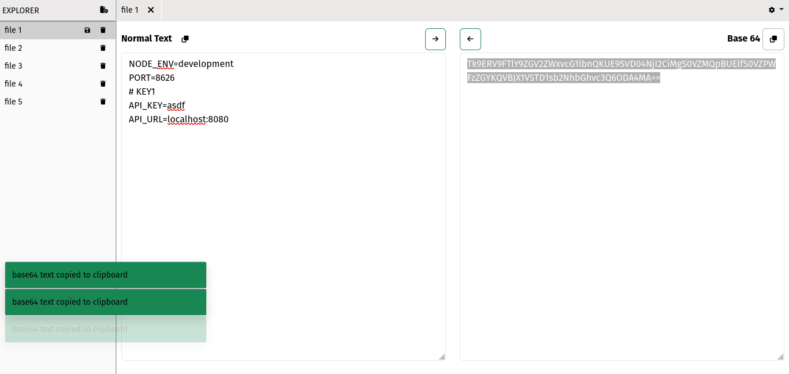

#### Simple and fully client side base64 encoder and decoder powered by js on browser

> This is a simple tool to convert your normal text to base64 and vice versa.

- The conversion is performed in client browser. It uses js [btoa](https://developer.mozilla.org/en-US/docs/Web/API/btoa) and [atob](https://developer.mozilla.org/en-US/docs/Web/API/atob) function.

- It has a simple UI interface to manage many files. All of the files data is managed in localStorage of browser.

> Since this tool is completely client side, It would probably be preferrable to use for handling conversion of secured strings (like env files).

[Try out from here](https://prijal-bista.github.io/base-64-encoder-and-decoder)

#### Screenshots

<table style="padding:10px">
  <tr>
    <td></td>
    <td></td>
  </tr>
    <tr>
    <td></td>
    <td></td>
  </tr>
</table>
